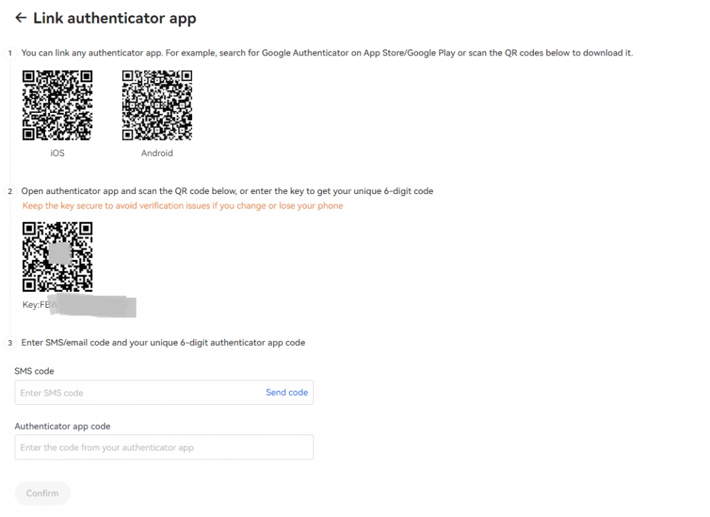

# Complete Guide to OKX Account Registration, Security & Verification

Signing up for a cryptocurrency exchange shouldn't feel like solving a puzzle. Whether you're looking to trade Bitcoin, Ethereum, or explore hundreds of altcoins, getting your OKX account set up properly from the start saves headaches later. This guide walks you through registration, two-factor authentication, and identity verification—the three essentials that let you trade with confidence and higher limits.

---

**OKX** (formerly OKEx) is a cryptocurrency exchange where you can trade digital currencies from BTC, ETH, USDT, USDC, DOT to hundreds of smaller-cap altcoins. The platform has attracted over 20 million global customers with spot and derivatives trading products, along with lending and mining solutions.

In this article, I'll show you how to register, log in, enable two-layer security, and verify your identity for an OKX account in detail—with 100% success.

## How to Register an OKX Account

OKX.Com lets you register an account using either your **phone number** or **email**.

You'll need:
- Your **email address**
- A **password** with more than 8 characters, including numbers and special characters
- **Referral code (optional):** 47044926

**Step 2:** Click the images in the given order, then press OK.

**Step 3:** Go to your email to receive the code and enter it to complete registration.

That's it—you've registered your **OKX account**. Next, I'll guide you through enabling security and verifying your identity to unlock full trading capabilities.

## How to Enable Two-Factor Authentication (2FA)

### Logging into Your OKX Account

Enter your **Email** & **Password** to log in, then click "**Login**".

**Enable 2FA security** to protect your account. You can use the Google Authenticator app to scan the QR code and receive OTP codes. Let's look at how to enable two-factor authentication for your OKX account.

**Step 1:** Click on the profile icon and select "**Security**".

**Step 2:** In the "**Authenticator app**" section, click "**Set**".

👉 [Set up your OKX account security in under 2 minutes and trade with peace of mind](https://www.okx.com/join/47044926)

**Step 3:** Use the Google Authenticator app downloaded on your phone to scan the QR code. After scanning, you'll see a 6-digit Authenticator code that refreshes every 30 seconds.

- Click "**send code**" to receive a code via email/SMS, then enter it in the email/SMS code field
- Enter the 6-digit code from your Google Authenticator app into the Authenticator app code field
- Finally, click "**Confirm**" to complete the process

## How to Complete Identity Verification (KYC)

**Identity verification (KYC)** helps you protect your account and raise your trading limits on OKX to 500 BTC and 100,000 USD for P2P trading within 24 hours.

**Step 1:** Select "**Verification**".

**Step 2:** Click **Start verification** to enter and upload your information.

**Step 3:** Click on the Mobile phone option, then scan the QR code to capture your ID card/citizen identification card and upload it to the platform. After completing all steps, wait for the exchange to confirm your successful KYC verification.

---

## Conclusion

Setting up your OKX account correctly from day one makes everything smoother down the road. You've now registered, secured your account with 2FA, and completed identity verification—which means you're ready to trade with higher limits and better protection. 

👉 [Why traders choose OKX for secure, high-limit cryptocurrency trading](https://www.okx.com/join/47044926)

The platform's straightforward verification process and robust security features make it easier to focus on what matters: making informed trading decisions. Whether you're into spot trading, derivatives, or exploring DeFi opportunities, you've got the foundation in place.
